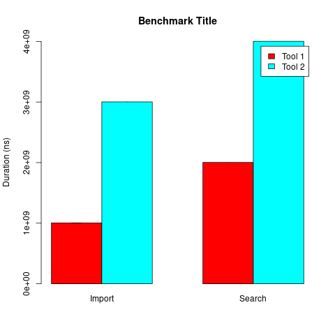

# bench-md

Automatically generate a benchmark graph from a markdown file.



    # Benchmark Title

    ## Tool 1

    ### Import

    ```
    sleep 1
    ```

    ### Search

    ```
    sleep 2
    ```

    ---

    ## Tool 2

    ### Import

    ```
    sleep 3
    ```

    ### Search

    ```{1}
    sleep 4
    ```

## Usage

```
./src/bench-md bench.md
```

You can specify a different output filename:

```
./src/bench-md bench.md bench.png
```

## Structure

The top heading is used as graphic title. The second level correspond to a
serie and, finally, the third heading level is a group of bar.

Then each code block is executed ten times. The mean of execution time and the
standar deviation is plotted (the sd is not displayed in this example, sleep is
too accurate).

You can generate an intermediate graphic by adding a line `---`.

You can specify the number of repetitions:

    ```{1}
    sleep 4
    ```

This code will be executed only once.
